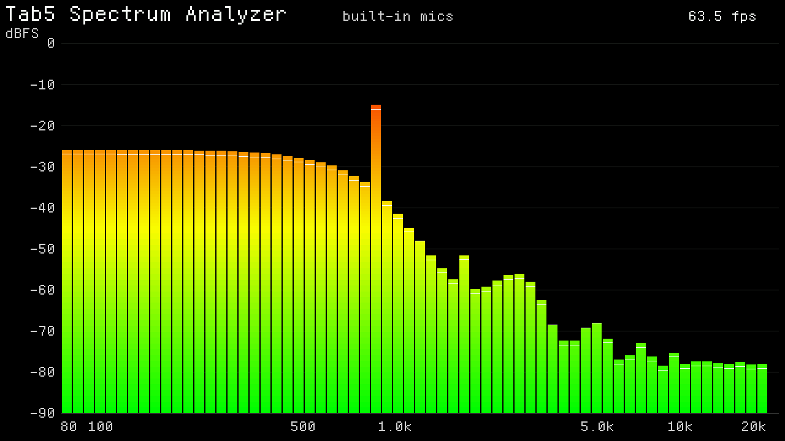

# Lothesome Audio Analyzer *for M5Tab5*

The M5Stack Tab5's two built-in microphones as a live spectrum: 1024
samples at 48 kHz, Hamming-windowed, an FFT, and 64 log-spaced bars from
80 Hz to 24 kHz on a dBFS scale, with peak markers. Only the rows that
changed are redrawn each frame.



*Not a photo: `analyzer.c`'s drawing code run on a PC against a stand-in
for the display, with a made-up spectrum, and read back through the same
landscape mapping the board uses. The layout, labels and colours are
the firmware's; the bars are not a real measurement.*

A C port of the Arduino sketch in
[m5tab5_spectrum_analyzer](https://github.com/Sudrien/m5tab5_spectrum_analyzer),
kept unchanged in `original/` for reference. It runs on plain ESP-IDF
with no M5Unified and no Arduino core, on three libraries pulled out of
[Defeatist Music Player for M5Tab5](https://github.com/Sudrien/defeatist-music-player-for-m5tab5):

| Library | For |
|---|---|
| [feckless-drivers-for-m5tab5](https://github.com/Sudrien/feckless-drivers-for-m5tab5) | the I2C bus and IO expanders, the ES7210 microphone capture |
| [feckless-graphics-handler-for-m5tab5](https://github.com/Sudrien/feckless-graphics-handler-for-m5tab5) | the panel, the framebuffer, text |
| [esp-dsp](https://components.espressif.com/components/espressif/esp-dsp) | the FFT |

## Building

ESP-IDF 5.5 or later:

```
idf.py set-target esp32p4
idf.py build flash monitor
```

Rev 2 Tabs (ST7121 panel) only; see feckless-graphics-handler.

Once a second the log prints the framerate and where each frame's time
went, as `FPS: ... | capture ...ms  fft ...ms  draw ...ms`.

The microphones are read by a task of their own into a ring, and each
frame takes the newest 1024 samples from it, so drawing sets the
framerate and the window is always the latest 21.3 ms of sound.

## Where the sound comes from

In order of preference:

1. **A USB microphone** on the USB-A port -- a UAC headset or a USB mic.
   It runs at its own sample rate, and the axis runs to that rate's
   Nyquist: a 16 kHz headset shows 80 Hz to 8 kHz.
2. **A headset on the 3.5 mm jack.**
3. **The two built-in microphones.**

The source is named at the top of the screen. The jack senses a plug,
not a microphone, so plain headphones give an empty spectrum. Plug in
directly: full-speed USB audio devices do not work behind a hub on the
Tab5's port.

## The scale

0 dBFS is digital full scale. It needs no calibration and is not dB SPL:
turning it into acoustic level needs an acoustic reference, which the
original README's calibration section explains.

## Tuning

`main/spectrum.h` has the numbers: `SPECTRUM_MIN_DBFS` / `MAX_DBFS` for
the vertical range, `ATTACK_TAU` and `RELEASE_TAU` for how fast bars
rise and fall, `PEAK_FALL_PER_SEC`, `SPECTRUM_FFT_SIZE` (512 for more
headroom, 2048 for finer bass), `SPECTRUM_BARS`. `main/analyzer.c` has
the rotation, the backlight and an optional frame cap.

## Tests

```
make -C test
```

`main/spectrum.h` on the host: dBFS scaling against a direct DFT, the
band table, the ballistics' independence from framerate.

## Licence

MIT. See `LICENSE`.
